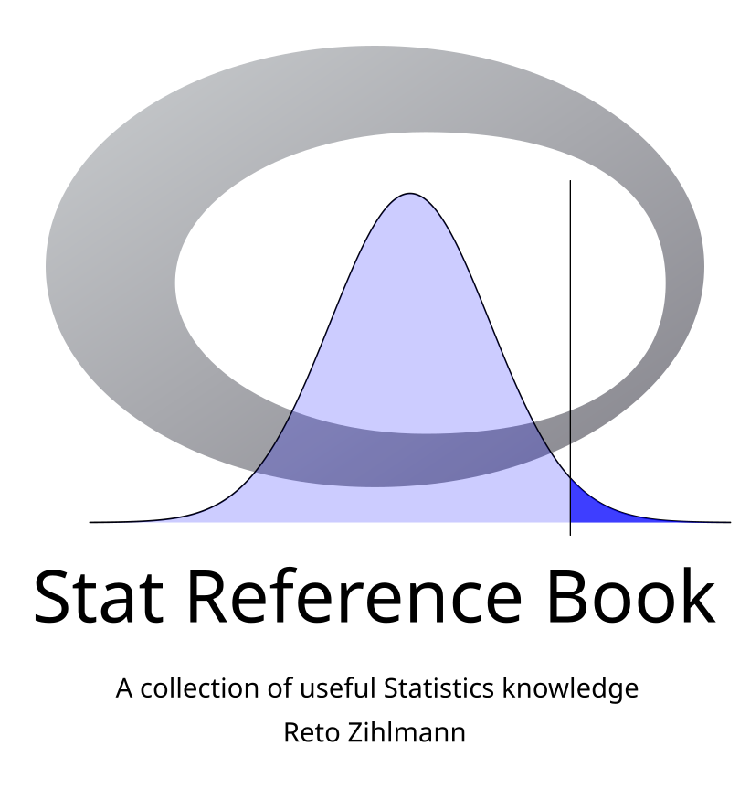

--- 
title: "Statistics Reference Book"
author: "Reto Zihlmann"
date: "`r Sys.Date()`"
site: bookdown::bookdown_site
documentclass: book
bibliography:
  - "`r system('kpsewhich bib.bib', intern=TRUE)`"
  - bib_packages.bib
biblio-style: apalike
link-citations: yes
description: "This is a collection of useful statistics knowledge"
github-repo: "retodomax/Stat_Ref_Book"
cover-image: "figures/01_cover/Cover.svg"
favicon: "figures/00_icon/icon2.ico"
---

# Introduction {-}

```{r, setup, include=FALSE}
knitr::opts_chunk$set(comment = "##",
                      tidy = FALSE,
                      fig.align = "left",
                      out.width = "50%",
                      fig.width = 7,
                      fig.height = 5,
                      echo = TRUE,
                      warning = FALSE,
                      message = FALSE,
                      error = FALSE)
```


```{r echo = FALSE, out.width='40%', fig.align = 'center'}

```


***

This book contains a constantly growing collection of useful statistics knowledge. The book is written in [RMarkdown](https://rmarkdown.rstudio.com/) with [bookdown](https://bookdown.org/).


***

<a rel="license" href="http://creativecommons.org/licenses/by-nc-sa/4.0/"></a><br />This work is licensed under a <a rel="license" href="http://creativecommons.org/licenses/by-nc-sa/4.0/">Creative Commons Attribution-NonCommercial-ShareAlike 4.0 International License</a>.


***

```{r include=FALSE}
# automatically create a bib database for R packages
knitr::write_bib(c(
  .packages(), 'bookdown', 'knitr', 'rmarkdown'
), 'bib_packages.bib')
```

```{r include=FALSE}
# automatically install necessary libraries


pkgTest <- function(x) {
    if (!require(x,character.only = TRUE))
    {
      install.packages(x,dep=TRUE)
        if(!require(x,character.only = TRUE)) stop("Package not found")
    }
}

pkgTest("carData")
pkgTest("devtools")
pkgTest("faraway")
pkgTest("lme4")
pkgTest("MASS")
pkgTest("car")
pkgTest("multcomp")
pkgTest("lmerTest")


if( !require("FunRZ", character.only = TRUE)){
  devtools::install_git("https://github.com/retodomax/FunRZ")
}
if( !require("DataRZ", character.only = TRUE)){
  devtools::install_git("https://github.com/retodomax/DataRZ")
}
```

Now math

$$
c^2 = \sqrt{a^2 + b^2}
$$